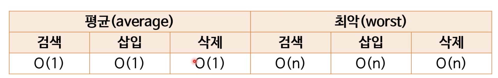
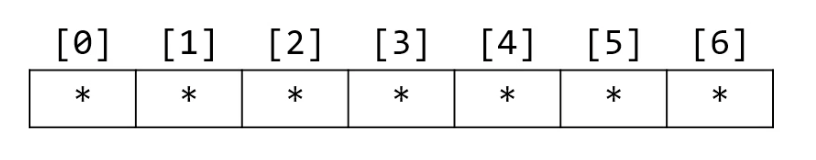
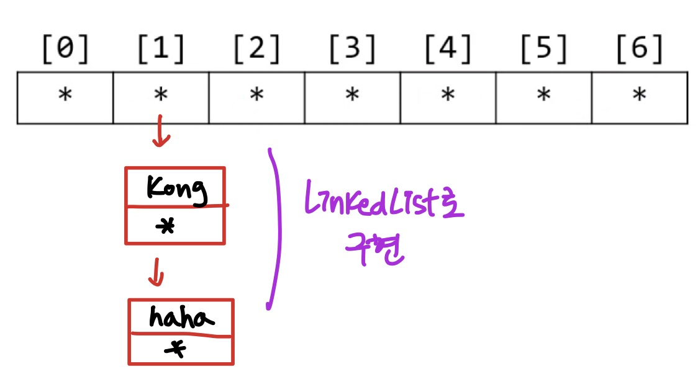
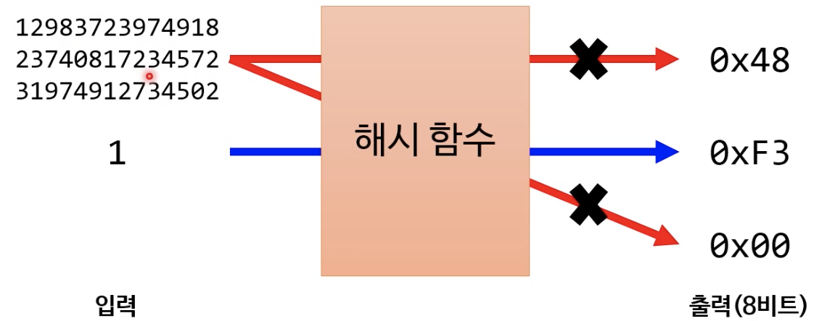
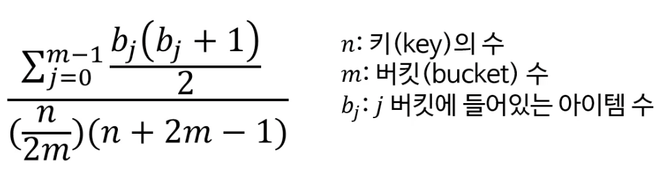

## 해시 테이블

* 평균이 *O(1)* 이라 굉장히 빠른 탐색 알고리즘이다.

## 해시 작동 방법

### 삽입

1. 해시 테이블에 비정형 데이터(ex. string)를 넣으려 한다.

2. 비정형 데이터는 숫자처럼 하나로 떨어지는 게 아니기 때문에 해시 함수를 이용하여 숫자로 만든다.

    * "kong" 을 해시 함수에 넣었더니 8이 나왔다고 가정하자. (해시함수를 돌리면 32bit 짜리 정수가 나온다)

3. 이 8을 해시 테이블에 넣는 색인으로 쓰려 한다. 하지만 해시 배열의 총 공간이 7개라 들어갈 수가 없네?

   ➜ 나머지 연산을 이용하자. 8%7 = 1

   ➜ 1번 버킷에 "kong" 을 넣자.

   ➜ 해시 함수를 구하는 시간은 상수 시간이므로, 결국 "kong" 을 삽입하는데 *O(1)* 의 시간이 걸렸다.

### 검색

* 삽입과 마찬가지이다. "kong" 을 검색하고 싶으면, "kong"을 해시함수 돌려서 나머지 연산한 결과 1을 가지고 1번 버킷에 있는 데이터를 바로 참조해주면 되므로 *O(1)* 의 시간복잡도를 가진다.

### 주의할 점

1. 중복이 발생하면 어떻게 하나?

    * "haha" 를 삽입하려고 해시 함수를 돌렸더니 똑같이 1번 bucket 이 나오는 경우

    * 해결법 : bucket 하나하나를 linkedList 로 만든다.

      

2. n 개의 데이터를 삽입하는데 전부 1번 위치에 들어가게 되면?

   검색,삽입,삭제 시 ➜ n 번을 검색해야 하고, n 번을 지나쳐서 삽입해야 하고, n 번 지나쳐서 삭제해야 함

   ➜ 최악인 *O(n)* 이 나온다.

#### 이 중복을 최대한 방지하는 방법

* 테이블의 크기를 충분히 크게 해주고, 테이블의 크기가 prime number 가 되도록 만들어준다. (위의 예에서는 크기가 7이므로 소수이다)

 

## 해시 맵

* 키(key) - 값(value) 쌍을 저장하는 자료 구조
    * 예: "kong" - "강아지이다"
    * 해시 테이블과의 차이점은 해시 테이블은 "kong" 만 저장하지만, 해시 맵은 "kong" 과 "강아지이다" 를 쌍으로 저장한다.
        * 보통 key, value 를 같은 위치(index)에 담기 위해 배열을 2개 만든다.
* 저장 및 검색
    * 해시 테이블을 이용하여 키를 저장하고 값은 그 키와 같은 위치에 저장
    * 검색도 키를 이용해서 저장된 위치를 찾는 게 전부

 

## 다양한 해시 알고리듬의 용도

* 해시는 컴퓨터 공학에서 매우 근본이 되는 알고리듬 중 하나이다.
* 해시 알고리듬의 용도 예
    * 해시 테이블에서 데이터를 저장할 위치를 찾기 위해
    * 길이가 긴 데이터 둘을 빨리 비교하기 위해 (Java의 hashCode 함수)
        * 단, 다른 경우만 빨리 비교 가능

 

## 해시 함수의 정의

* **임의의 크기**를 가진 값을 **고정 크기**의 값에 대응시키는 함수
* 여전히 함수이므로 수학에서의 함수의 정의도 만족해야 함
* 입력값이 같으면 언제나 출력값도 같아야 함 (결정론적 작동)

 

## 해시 알고리듬 분류

해시 알고리듬의 속성은 비암호학적이냐 암호학적이냐에 따라 조금씩 다름

* (비암호학적) 해시 함수
* 암호학적 해시 함수

### 아래와 같은 것도 있다. 굳이 분류하자면 비암호학적 해시 함수에 속한다.

* 체크섬 (검사합, checksum)
* 순환 중복 검사 (cyclic redundancy check, CRC)

 

## 모든 해시 알고리듬의 속성

* 효율성 (efficiency)
* 균일성 (uniformity)

## 균일성

* 해시 함수의 출력값이 고르게 분포될수록 균일성이 높다. 흔히 훌륭한 해시 함수는 균일성이 높아야 한다고 한다.
    * 즉, 출력 범위 안의 모든 값들이 동일한 확률로 나와야 함 (균등 분포)
    * 이러면 해시 충돌이 적어 *O(1)* 해시 테이블을 기대할 수 있음
* 완벽한 해시 함수: 해시 충돌이 전혀 없는 함수
    * 하지만 이것도 입력값이 매우 제한적일 경우에만 가능
    * 이유: birthday problem

## 균일성의 측정

* 카이제곱 검정 (chi-squared test)을 이용

* 결과가 0.95 ~ 1.05 사이면 균일한 분포를 가진 해시 함수라 봄

  

* 균일성을 높일 수 있는 실용적 방법
    1. 해시값이 덜 중복되게 버킷 수를 정할 것 (소수를 사용)
    2. 완벽한 '눈사태' 가 나도록 해시 함수를 설계할 것

### 눈사태 효과

* 입력값이 약간만 바뀌어도 출력값이 굉장히 많이 바뀌는 것
    * 보통 암호학적 알고리듬이 매우 선호하는 효과 (보안상에도 좋으니깐)
    * 알고리듬의 규칙을 쉽게 유추할 수 없음
* 엄격한 눈사태 기준
    * 입력값에서 1비트를 뒤집으면 출력값의 각 비트가 뒤집힐 확률이 50%
    * 이 기준을 충족하는 해시 함수는 분포가 균일할 가능성이 매우 높음

 

## 지역 민감 해시 (locality-sensitive hashing)

* 해시 충돌의 최소화 대신 최대화를 목표로 하는 알고리듬
    * abc 와 abd 의 해시값은 비슷했으면 좋겠고, abc와 xyz의 해시값은 완전히 달랐으면 좋겠다 하는 것!
* 비슷한 내용을 가진 데이터끼리 충돌해야 함
* 엄청나게 많은 데이터에서 비슷한 것들을 찾는 용도로 쓰인다.
    * 스팸 메일 찾기
    * 웹 검색 엔진에서 비슷한 문서 추천하기
    * 음원, 사진 등의 저작권 침해 검사 등

 

## 효율성

* 보통 충돌이 좀 더 나더라도 빠른 해시 함수를 선호
    * 어차피 해시 충돌은 드문 일이고 몇 개 난다고 *O(1)* 에서 크게 느려지진 않기 때문
    * 저장된 데이터를 빨리 찾는 용도가 더 중요
* 해시함수 계산하기 위해 나온 하드웨어 (그래픽 카드 등) 쓰면 좋지 않겠냐?
    * 그렇지만은 않다. 소프트웨어에서는 빨리 실행되지만 하드웨어에서는 가속이 어려운 해시를 선호하는 경우도 있다
    * 암호학적 해시 알고리듬과 관련되어 있음

 

