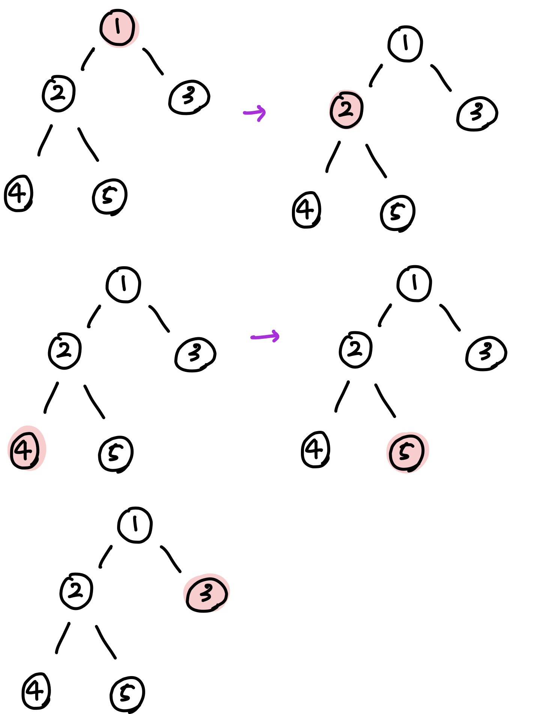

## 이진트리 (Binary Tree)
### 이진트리란
- 비선형 자료구조
- 데이터의 탐색 속도 증진을 위해 사용하는 구조

### 이진트리가 빠른 탐색을 가능하게 해주는 원리
- root 노드에서 target 노드까지 가려면?
  - 왼쪽 노드로 가자마자 오른쪽 노드 전체는 볼 필요가 없어진다.
  - 한 번 내려갈때마다 탐색해야 하는 데이터가 1/2씩 줄어든다는 점에서 결과적으로 높이가 Log n이 된다.
  

  

### 이진트리는 어떻게 구현할 것인가?
- 힙 정렬을 구현할 때를 생각해보자
  - 완전이진트리 형태로 만드므로 배열에 차례대로 인덱스 0부터 노드의 개수만큼 넣어주면 된다
  - But, 완전 이진트리가 아닌 경우 배열로 표현하기 어렵다. 
    - why? 완전이진트리가 아닌데 배열로 표현하게 되면..
      
      
      - 4개의 노드만 만들었을 뿐인데 실제로 배열에 담을 공간은 14개 만큼이나 필요하다. 
      - 이런 메모리의 낭비를 줄이기 위해 포인터를 사용하는 것이다.
  

- 완전이진트리가 아닌 일반 이진트리를 구현하기 위해서는 "포인터" 를 이용해 특정한 루트에서 자식 노드로 접근하는 것이 더 용이하다.

### 트리를 만들어 데이터를 삽입하고 각각의 데이터를 하나씩 탐색해보자 (포인터 이용)
#### 1. 전위순회 (Preorder Traversal)
방문순서 : `root → left → right`

1 → 2 → 4 → 5 → 3

#### 2. 중위순회 (Inorder Traversal)
방문순서 : `left → root → right`

4 → 2 → 5 → 1 → 3

#### 3. 후위순회 (Postorder Traversal)
방문순서 : `left → right → root`

4 → 5 → 2 → 3 → 1
