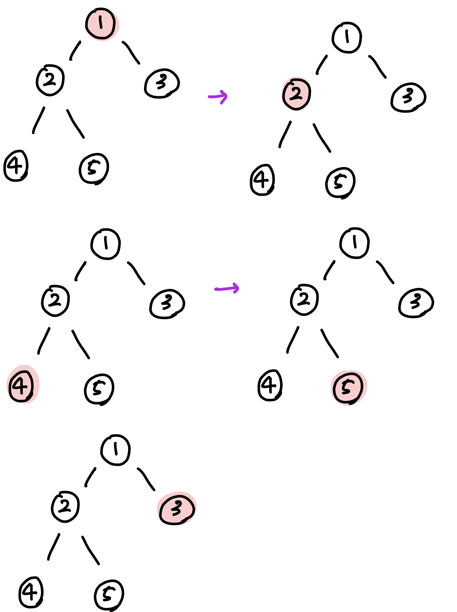
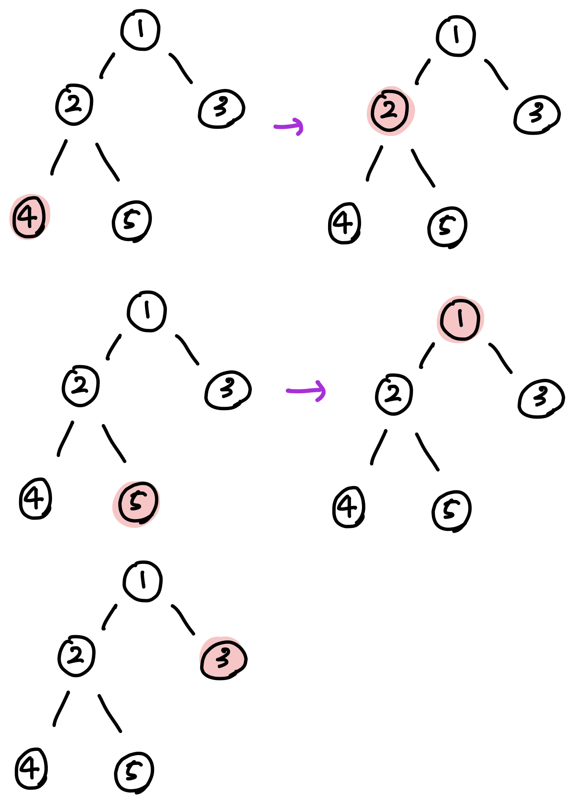
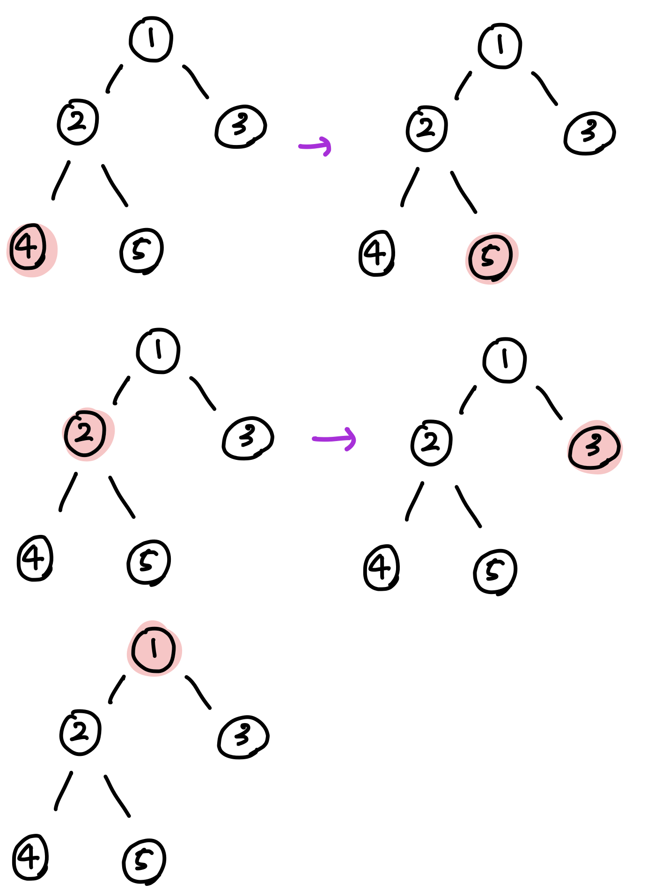
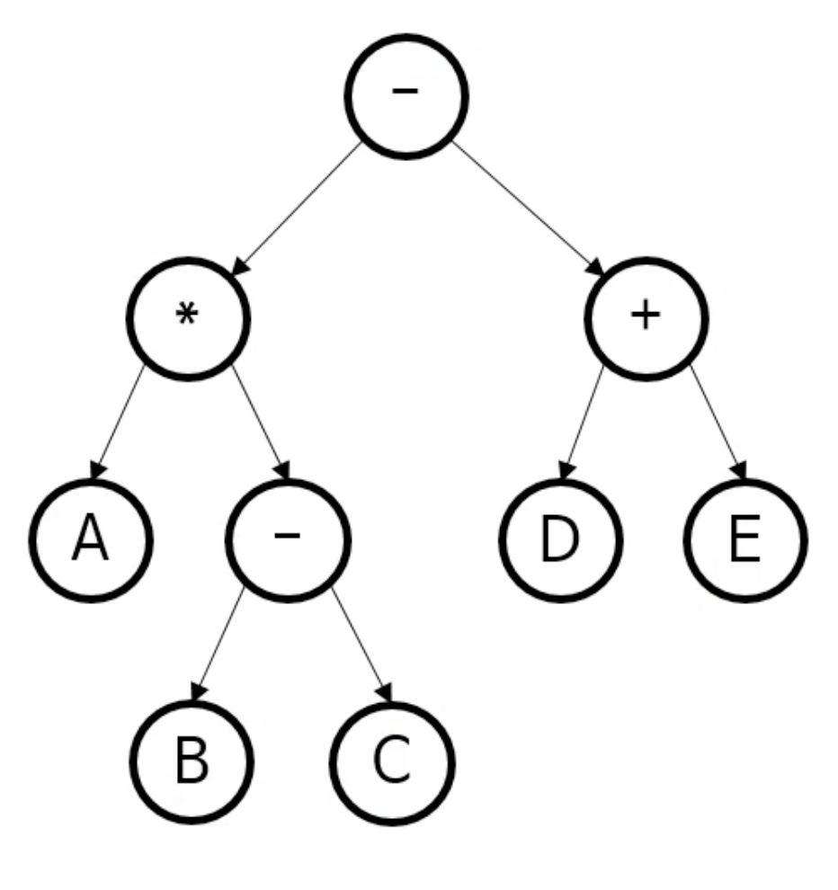

# 트리
* [트리 순회](#트리-순회)

# 트리 순회(tree traversal)

> 대표적인 3가지 트리 순회법
>
> * 전위 순회
> * 중위 순회
> * 후위 순회


## 1. 대표적인 3가지 트리 순회법

### 1-1. 전위순회 (Preorder Traversal)

방문순서 : `root → left → right`<br/>

`1 → 2 → 4 → 5 → 3`
<br/><br/><br/>

### 1-2. 중위순회 (Inorder Traversal)

방문순서 : `left → root → right`<br/>

`4 → 2 → 5 → 1 → 3`
<br/><br/><br/>

### 1-3. 후위순회 (Postorder Traversal)

방문순서 : `left → right → root`<br/>

`4 → 5 → 2 → 3 → 1`
<br/><br/><br/>

### 중위 순회 코드를 간단히 살펴보자.

```java
// 재귀적으로 확실히 깔끔하게 구현 가능
public static void traverseInOrder(Node node) {
        if (node == null) {
            return;
        }
        traverseInOrder(node.left);
        System.out.println(node.data);
        traverseInOrder(node.right);
    }
```


## 2. 전위 순회의 용도

### 2-1. 트리를 복사하는 경우

* 부모가 있어야 자식도 추가할 수 있음, 따라서 전위 순회가 적합
* 다른 순회는 부모가 중간 혹은 마지막에 오므로 트리를 복사한다고 생각했을 때, 직관적이지 않음 (물론 다른 순회로도 복사는 가능하다)

### 2-2. 수식의 전위 표기법

* 수식은 보통 *중위 표기법*을 사용한다.
    * 괄호로 우선 순위를 정해줄 수 있음
    * 아래 그림의 트리를 중위 순회하면 다음과 같은 수식이 나온다.
        * *A X (B-C) - (D+E)*



* 전위 표기법 (prefix notation)
    * 폴란드 표기법 (Polish notation) 이라고도 불림
    * 연산자/괄호의 우선 순위가 없음 (읽는 순서대로)
    * 따라서 컴퓨터로 계산하기 좀 더 편함

* 위 예는 후위 순회로 더 쉽게 구현이 가능하다.

    * 앞에서부터 읽으면서 스택에 집어넣으면 된다

      ​	<a href="https://www.codecogs.com/eqnedit.php?latex=\bg_white&space;-\times&space;A-BC-&plus;DE" target="_blank"></a>

* 후위 표기법 (postfix notation) 이라고 한다.

    * 역 폴란드 표기법 (reverse Polish notation)

      


## 3. 전위/중위/후위 순회 - 간단한 가이드

* 앞에서 본 예 외에도 알고리듬에 따라 셋 중 하나를 사용한다.
* 간단한 가이드
    * 리프보다 루트를 먼저 봐야 한다면 전위 순회
    * 리프를 다 본 다음에 다른 노드를 봐야 한다면 후위 순회
    * 순서대로 봐야 한다면 중위 순회


