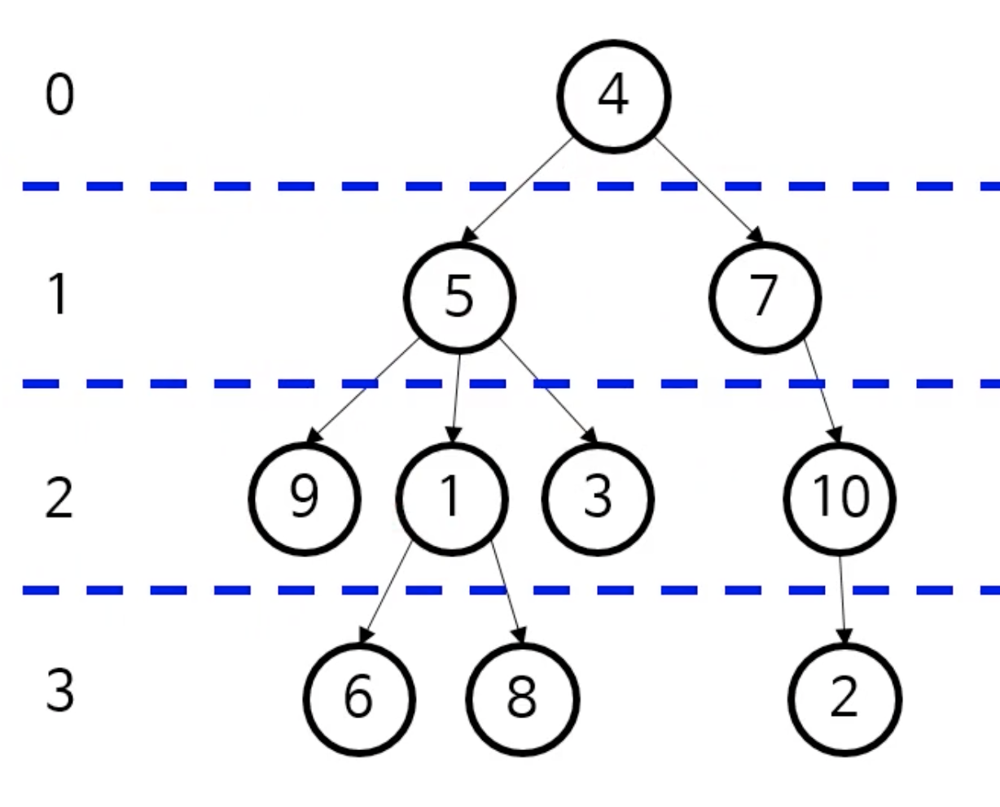
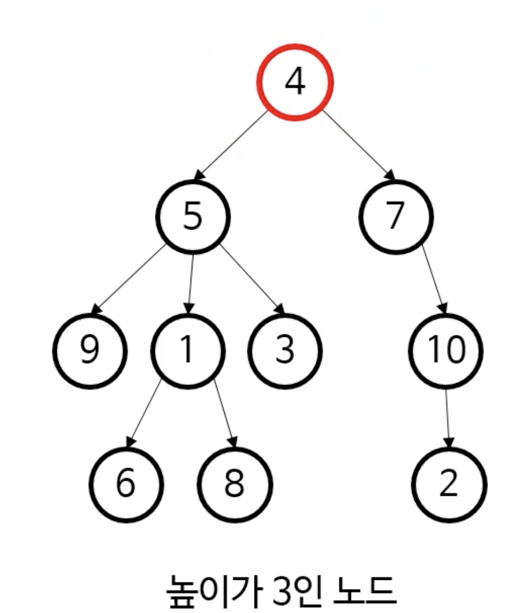
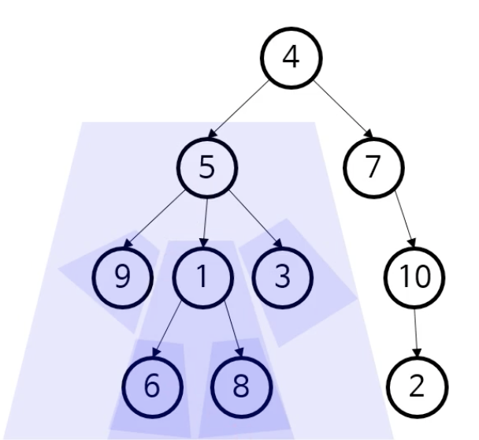
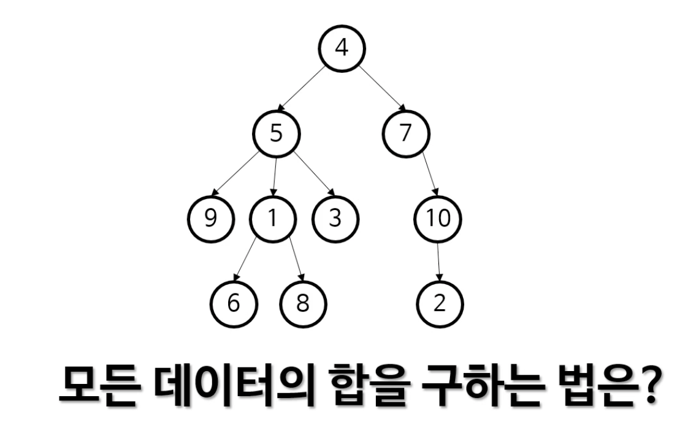
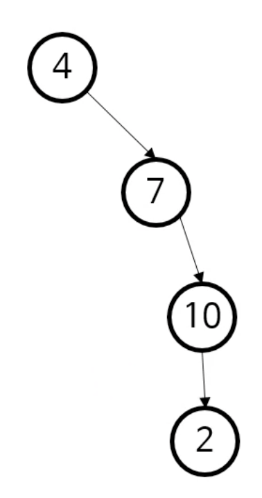

# 트리
* [트리](#트리)
  * [트리 관련 용어](#트리-관련-용어)
  * [트리는 재귀적 자료구조](#트리는-재귀적-자료구조)
  * [트리를 저장하려면 코드로 어떻게 표현해야 할까?](#트리를-저장하려면-코드로-어떻게-표현해야-할까?)
  * [트리의 용도](#트리의-용도)
* [트리 순회](#트리-순회)

# 트리
## 트리 관련 용어

* 노드(node): 실제로 저장하는 데이터
* 루트(root) 노드: 최상위에 위치한 데이터
* 리프(leaf) 노드: 마지막에 위치한 데이터들
* 부모-자식: 연결된 노드들 간의 상대적 관계
* 깊이(depth): 노드 ➜ 루트 경로의 길이
    * 9는 깊이가 2이다. 4는 깊이가 0이다.


* 높이(height): 노드 ➜ 리프 경로의 최대 길이
    * 노드 5의 높이는 2이다.
    * 어떤 노드의 높이가 아닌, 트리의 높이를 물어보면 루트 노드의 높이를 물어보는 것과 같다.



* 하위 트리(subtree): 어떤 노드 아래의 모든 것을 포함하는 트리
    * 하위 트리 그 자체가 트리 ➜ 트리가 **재귀적으로 작동하기 좋은 자료구조**라는 걸 알 수 있다.




## 트리는 재귀적 자료구조



* 4 + 왼쪽 subtree 의 총합 + 오른쪽 subtree의 총합 .. ➜ 이렇게 재귀적으로 더해나갈 수 있다.


## 트리를 저장하려면 코드로 어떻게 표현해야 할까?

### 1) 일반적인 트리

```java
public class Node {
  public int data;
  public ArrayList<Node> children; // hashMap 으로 구현해도 되고.. 마음대로
}
```

### 2) 이진 트리

```java
public class Node {
  public int data;
  public Node left;
  public Node right;
}
```

### 3) 자식이 최대 하나인 트리

```java
public class Node {
  public int data;
  public Node child;
}
```



➜ 연결 리스트이다. 연결리스트는 결국 트리에서 좀 더 제약을 가한 자료구조이다.


## 트리의 용도

* 계층적 데이터를 표현
    * HTML 이나 XML 의 문서 개체 모델(DOM) 을 표현
    * JSON 이나 YAML 처리 시 계층 관계를 표현
    * 프로그래밍 언어를 표현하는 추상 구문 트리(abstract syntax tree)
    * 인간 언어를 표현하는 파싱 트리(parsing tree)
* 검색 트리를 통해 효율적인 검색 알고리듬 구현 가능
* 그 외 다수

# 트리 순회(tree traversal)
> 대표적인 3가지 트리 순회법
>
> * 전위 순회
> * 중위 순회
> * 후위 순회


## 1. 대표적인 3가지 트리 순회법

### 1-1. 전위순회 (Preorder Traversal)

방문순서 : `root → left → right`<br/>

`1 → 2 → 4 → 5 → 3`
<br/><br/><br/>

### 1-2. 중위순회 (Inorder Traversal)

방문순서 : `left → root → right`<br/>

`4 → 2 → 5 → 1 → 3`
<br/><br/><br/>

### 1-3. 후위순회 (Postorder Traversal)

방문순서 : `left → right → root`<br/>

`4 → 5 → 2 → 3 → 1`
<br/><br/><br/>

### 중위 순회 코드를 간단히 살펴보자.

```java
// 재귀적으로 확실히 깔끔하게 구현 가능
public static void traverseInOrder(Node node) {
        if (node == null) {
            return;
        }
        traverseInOrder(node.left);
        System.out.println(node.data);
        traverseInOrder(node.right);
    }
```


## 2. 전위 순회의 용도

### 2-1. 트리를 복사하는 경우

* 부모가 있어야 자식도 추가할 수 있음, 따라서 전위 순회가 적합
* 다른 순회는 부모가 중간 혹은 마지막에 오므로 트리를 복사한다고 생각했을 때, 직관적이지 않음 (물론 다른 순회로도 복사는 가능하다)

### 2-2. 수식의 전위 표기법

* 수식은 보통 *중위 표기법*을 사용한다.
    * 괄호로 우선 순위를 정해줄 수 있음
    * 아래 그림의 트리를 중위 순회하면 다음과 같은 수식이 나온다.
        * *A X (B-C) - (D+E)*


* 전위 표기법 (prefix notation)
    * 폴란드 표기법 (Polish notation) 이라고도 불림
    * 연산자/괄호의 우선 순위가 없음 (읽는 순서대로)
    * 따라서 컴퓨터로 계산하기 좀 더 편함

* 위 예는 후위 순회로 더 쉽게 구현이 가능하다.

    * 앞에서부터 읽으면서 스택에 집어넣으면 된다

      ​	<a href="https://www.codecogs.com/eqnedit.php?latex=\bg_white&space;-\times&space;A-BC-&plus;DE" target="_blank"></a>

* 후위 표기법 (postfix notation) 이라고 한다.

    * 역 폴란드 표기법 (reverse Polish notation)

      


## 3. 전위/중위/후위 순회 - 간단한 가이드

* 앞에서 본 예 외에도 알고리듬에 따라 셋 중 하나를 사용한다.
* 간단한 가이드
    * 리프보다 루트를 먼저 봐야 한다면 전위 순회
    * 리프를 다 본 다음에 다른 노드를 봐야 한다면 후위 순회
    * 순서대로 봐야 한다면 중위 순회


